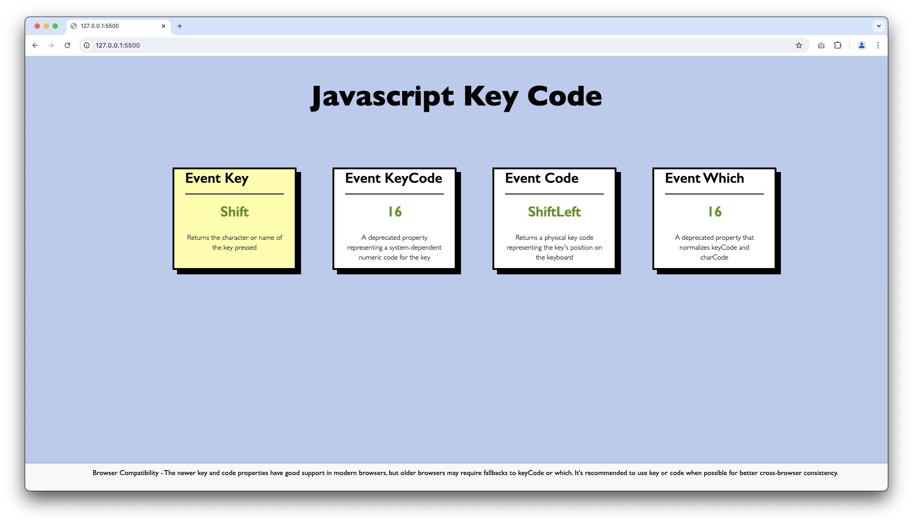

<div align="center">
    <h1>Javascript Key Code</h1>
</div>

<br />



## Overview

A Javascript Key Code application is a simple tool that allows users to find out the key event codes values that represent specific keys on a keyboard.

## Table of Contents

- [Features](#features)
- [Installation](#installation)
- [Technologies](#technologies)
- [License](#license)
- [Contact](#contact)

## Features

JavaScript key event codes are numeric values that represent specific keys on a keyboard. Here are the key points about JavaScript key event codes:

There are three main properties used to get information about which key was pressed:

- event.key: Returns a string representing the key value of the pressed key. This is the recommended property to use.
- event.code: Returns a string representing the physical key on the keyboard, regardless of the character it produces
- event.keyCode: Returns a numeric code for the pressed key. This property is deprecated and should be avoided

## Installation

### Step 1. Clone the repository

  ```git
git clone https://github.com/kumarmanuj/key-code-js.git
   ```

### Step 2. Change your current directory to the project directory

  ```bash
   cd key-code-js
  ```

### Step 3. Run program locally 

To open an index.html file in the default browser on MacOS using the command line, you can use the following command:

 ```bash
open index.html
```

To open an index.html file in the default browser on Windows using the command line, you can use the following command:

 ```bash
start index.html
```

## Technologies

- JavaScript
- Html
- CSS

## License

This project is licensed under the [MIT License](./LICENSE)

## Contact

For any inquiries or feedback, feel free to reach out:

- Email: [yomanuj@gmail.com](mailto:yomanuj@gmail.com)
- GitHub: [kumarmanuj](https://github.com/kumarmanuj)
